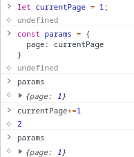

# Review Notes

- Ao rodar `docker-compose up`, o programa acaba não rodando pois, ao inspecionar os logs, vemos que houve algum erro de Typescript, no caso:

```bash
$ docker logs -f app-graphql 

> graphql-typescript@1.0.0 dev /home/node/app
> ts-node-dev --inspect --transpileOnly --ignore-watch node_modules src/server.ts

Ignore watch: [ 'node_modules' ]
Using ts-node version 3.3.0, typescript version 3.3.3333
Debugger listening on ws://127.0.0.1:9229/ffd11a71-1b5b-49c0-8bc7-6a9fe858e341
For help, see: https://nodejs.org/en/docs/inspector
[ERROR] 13:24:53 ⨯ Unable to compile TypeScript
src/jobs/Exoplanet.ts (38,42): Type '{ page: number; }' has no properties in common with type 'AxiosRequestConfig'. (2559)
```

- Depois de rodar o `docker-compose up`(que mapeia os volumes dessa pasta pro container, que por sua vez ao ser buildado dá um `chown` em tudo)
ocorre um erro de permissão ao eu dar um `yarn install` na minha máquina.

- Depois de consertado o erro de TS, o servidor subiu certinho.

- Observei uma falha na lógica que havia no `jobs/Exoplanet.ts`, em que foi feito:

```typescript

let currentPage = 1;

// ...

const params = {
  page: currentPage,
};

// ...

currentPage +=1;
```

Porém isso não vai fazer o que foi esperado, veja:



- Fora esses problemas, outras coisas que eu vi que poderiam ser melhoradas:
  - o `docker-compose.yml` e o `Dockerfile` ficaram meio estranhos, eles mapeiam o volume pro container, e dão um `chown`, porque?
    como eu desenvolveria nesse projeto? rodando via `docker-compose up -d` ou `yarn dev`?
  - commits no git, vi que só teve 1 commit, mas tenho certeza que o trabalho feito aqui teve vários passos e etapas que foram feitas
  - códigos/ferramentas não utilizados: tem um `jest.config.js` e uma dependência no `jest` e não utiliza-se teste;
    há algum(s) arquivo(s) no projeto que são antigos.
  - outras coisas mais específicas ao código eu comentei pelos arquivos do projeto.

Achei muito legal ter separado em um conceito de job que pega os dados ao start da aplicação,
desse jeito de fato diminui bastante o tempo os response times e o tráfego de rede.
Porém, se por acaso for atualizado algum dado na API externa, não há nenhum mecanismo de invalidação desse cache.

O código ficou bem enxuto, a estrutura do projeto, embora bem estruturada, ficou enxuta também.
